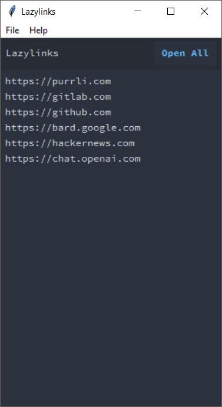

# Lazylinks

**Lazylinks** is a desktop GUI that provides a convenient way to manage and open
links.

> [!WARNING]
> This is a personal repository built as an "internal / inner source" tool. Use
> at your own risk!

**Here's what it looks like:**

## **Features:**

- **Loads configuration from a JSON file:** Customize your links, appearance,
  and behavior.
- **Lists links in a main window:** See all your links at a glance.
- **Opens links individually or all at once:** Choose how you want to access
  your links.
- **Offers menu options for:**
    - Editing the configuration file
    - Reloading the window
    - Viewing application information

## **Usage:**

1. **Create a `config.json` file:**
    - Use the default configuration provided for a quick start.
    - Customize it to fit your preferences.

2. **Run the application:**
    - Use the simple command `python lazylinks.py` to launch it.

## **Customization:**

- Edit the `config.json` file to adjust:
    - Links
    - Window title
    - Colors
    - Fonts
    - Window dimensions

## **Build**

To create a standalone executable from this Python script, refer to instructions
in [`build.py`](build.py) located in the `/root` directory.

## **Additional Information:**

- **Version:** 0.01
- **Libraries used:** tkinter, webbrowser, subprocess, json
- **Default configuration file path:** config.json